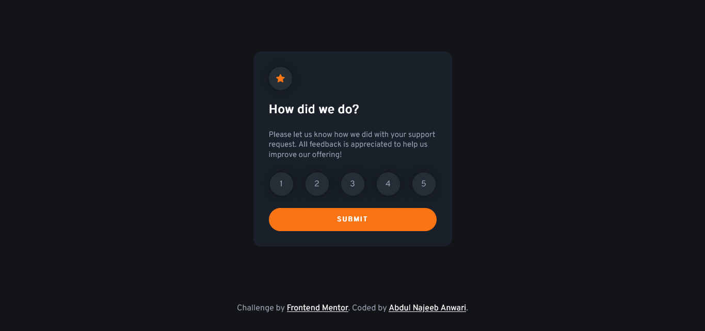
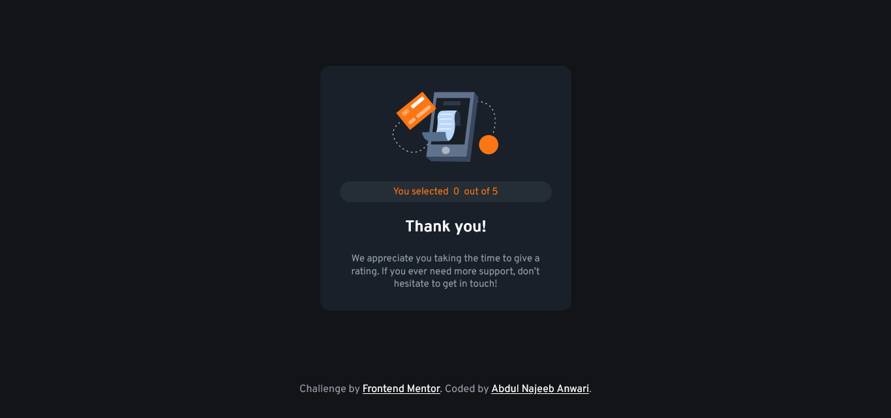

# Frontend Mentor - Interactive rating component solution

This is a solution to the [Interactive rating component challenge on Frontend Mentor](https://www.frontendmentor.io/challenges/interactive-rating-component-koxpeBUmI). Frontend Mentor challenges help you improve your coding skills by building realistic projects. 

## Table of contents

- [Overview](#overview)
  - [The challenge](#the-challenge)
  - [Screenshot](#screenshot)
  - [Links](#links)
- [My process](#my-process)
  - [Built with](#built-with)
  - [What I learned](#what-i-learned)
  - [Useful resources](#useful-resources)
- [Author](#author)


## Overview

### The challenge

Users should be able to:

- View the optimal layout for the app depending on their device's screen size
- See hover states for all interactive elements on the page
- Select and submit a number rating
- See the "Thank you" card state after submitting a rating

### Screenshot





### Links

- Solution URL: [Solotion URL](https://github.com/najeeb-anwari/interactive-rating-component-using-flexbox)
- Live Site URL: [Live URL](https://najeeb-anwari.github.io/interactive-rating-component-using-flexbox/)

## My process

### Built with

- Semantic HTML5 markup
- CSS custom properties
- Flexbox
- Mobile-first workflow

### What I learned

During this project I learned to work with nullish coalescing operator which is a great feature.

```js
document.querySelector("#rating").innerHTML = rating ?? 0;
```


### Useful resources

- [Nullish Coalescing Operator](https://developer.mozilla.org/en-US/docs/Web/JavaScript/Reference/Operators/Nullish_coalescing_operator) - I really liked this feature and will use it going forward.
- [Flexbox Froggy](https://flexboxfroggy.com/) - This is an amazing website which helped me review my flexbox skills. I'd recommend it to anyone because it is an interactive game to practice flexbox.


## Author

- Frontend Mentor - [@najeeb-anwari](https://www.frontendmentor.io/profile/najeeb-anwari)
- Github - [@najeeb-anwari](https://github.com/najeeb-anwari)
